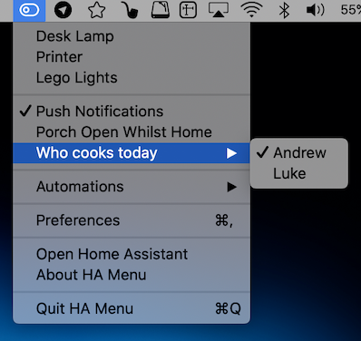
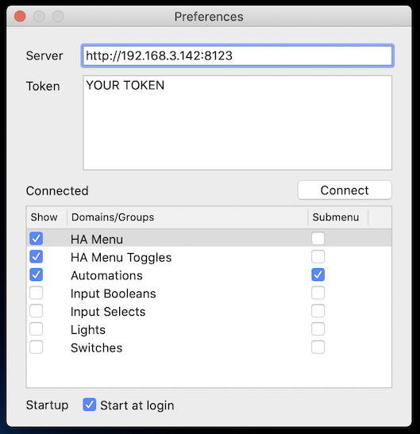

# HA Menu

A Mac OS Menu Bar app to perform common Home Assistant functions  
Currently HA Menu supports  
* Turning available switches, lights, automations and input_boolean's on and off
* Activating scenes and scripts
* input_select option menus  
  
HA Menu supports MacOS 10.13 (High Sierra) and later.



## Installation
**Manual**  
Get the latest HA.Menu.zip from [Releases](https://github.com/codechimp-org/ha-menu/releases)  
Unzip and copy the HA Menu app to your Applications folder

**Homebrew Cask**  
2.6 or later ```brew install --cask ha-menu```  
2.5 or earlier ```brew cask install ha-menu```

## Configuration
You will have needed to enable Allow app's downloaded from App Store and identified developers enabled in Security & Privacy Settings to run.  

For the server connection you can use your local ip:port as per the example, an external facing address you have setup via DuckDNS or similar, or your Nabu Casa URL.  Ensure you prefix with http:// or https:// as appropriate.

To create a token within HA, login to HA and click on your profile.  
Under Long Lived Access Tokens, create a new token, give it a name and copy the token value into HA Menu preferences.

Press Connect to validate your connection and get your groups.  You can now choose which domains/groups to display within HA Menu, drag them to reorder and optionally make them a submenu.



### Domains

Within the preference screen you can choose which domains to display.  Domains are a list of all entities within that domain, e.g. Lights will display all lights within HA Menu.  
If you want to display just a few items from a domain, create a custom group as detailed below.   
Entities within domains are displayed alphabetically.

### Groups

If you have a lot of entities within your domains you can have HA Menu display a specific set by [creating new groups within HA](https://www.home-assistant.io/integrations/group/).  
You can create multiple groups and they will be separated within the drop down menu.

First of all create your group(s) within groups.yaml as per the example.  Note the group entity id is ha_menu in this example.  Validate and Reload Groups within HA (Configuration/Server Controls) to have the group added to HA. If you want multiple groups just repeat the block and rename the entity id/name and change your entity's.

Once you have the group(s) added to HA, within HA Menu go to Preferences and tick the Groups you want to be displayed.   
Close preferences to save these settings.

Now when you click on HA Menu again the group's you have setup will be displayed.  Entities within groups are displayed in the order they are added within the group (printer, lego_lights, desk_lamp, notifications, entry_alert, who_cooks in the example).  

Example groups.yaml
```yaml
ha_menu:
  name: HA Menu Switches
  entities:
    - switch.printer
    - switch.lego_lights
    - light.desk_lamp
    - input_boolean.notifications
    - automation.entry_alert
    - input_select.who_cooks
```

## Say Thanks
If you like HA Menu buy me a :coffee: via [PayPal](https://www.paypal.me/codechimporg/2)
